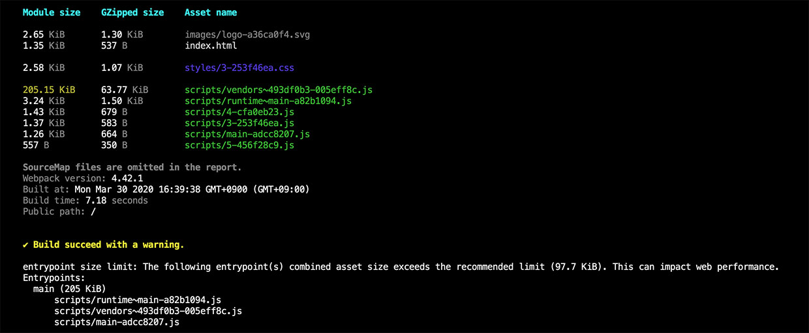

# webpack-stats


<br>Copyright 2020. mornya. All rights reserved.

> This project was generated by [Vessel](https://www.npmjs.com/package/@mornya/vessel). For a simple and quick reference, click [here](VESSEL.md).

## About
The library for displaying the contents of `Stats` generated after building the webpack to the console.



## Installation
해당 모듈을 사용할 프로젝트에서는 아래와 같이 설치한다.
```bash
$ npm install --save webpack-stats
or
$ yarn add webpack-stats
```

## Usage
아래와 같이 모듈을 import하여 사용한다. 아래 Consoleize.generate 설정에 사용된 값은 예시로 표기.
```typescript
import { Consoleize } from 'webpack-stats';
import webpack from 'webpack';

...

const isWebpackDevServerRun = false;
const webpackConfig = { ... };
const compiler = webpack(webpackConfig);

compiler.hooks.done.tap('done', (stats: webpack.Stats) => {

  // Display generated message in console
  const result = Consoleize.generate(stats.toJson({
      all: false,
      assets: true,
      children: true,
      warnings: stats.hasWarnings(),
      errors: stats.hasErrors(),
      // optional info
      version: !isWebpackDevServerRun,
      hash: !isWebpackDevServerRun,
      builtAt: !isWebpackDevServerRun,
      timings: !isWebpackDevServerRun,
      publicPath: true,
      outputPath: true,
    }),
    (isWebpackDevServerRun ? '' : 'dist'),
    webpackConfig.performance,
  );

  if (result) {
    console.log(result);
  }

});
```

## Methods

### `Consoleize.from`
Generates a message from stats file
- `statsFile`: filename (ex, stats.json)
- `dir`: the webpack build output directory name from project root (empty string does not display GZipped-size)
- `webpackConfigPerformance`: the webpack configuration of `performance` section object.
```typescript
Consoleize.from (statsFile: string, dir: string, webpackConfigPerformance: WebpackConfigPerformance);
```

### `Consoleize.generate`
Generates a message from stats object
- `statsJson`: result stats value of called by toJson() method
```typescript
Consoleize.generate (statsJson: webpack.Stats.ToJsonOutput, dir: string, webpackConfigPerformance: WebpackConfigPerformance);
```

## Change Log
해당 프로젝트의 [CHANGELOG.md](CHANGELOG.md) 파일 참조.

## License
해당 프로젝트의 [LICENSE](LICENSE) 파일 참조.
